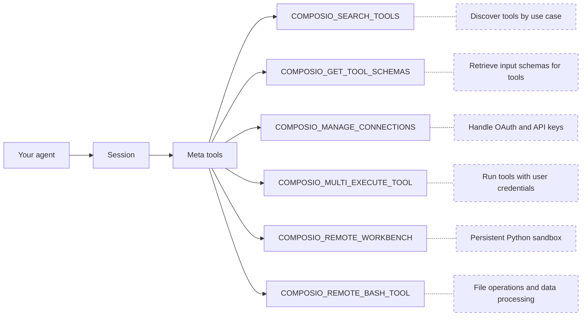

Composio connects AI agents to external services like GitHub, Gmail, and Slack. Your agent gets a small set of meta tools that can discover, authenticate, and execute tools across hundreds of apps at runtime.

This page is a high-level overview. Each concept has a dedicated page with full details:

1. [Users & Sessions](/docs/users-and-sessions): how users and sessions scope tools and connections
2. [Authentication](/docs/authentication): Connect Links, OAuth, API keys, and auth configs
3. [Tools and toolkits](/docs/tools-and-toolkits): meta tools, discovery, and execution
4. [Workbench](/docs/workbench): persistent Python sandbox for bulk operations
5. [Triggers](/docs/triggers): event-driven payloads from connected apps

For hands-on setup, see the [quickstart](/docs/quickstart).

## Sessions

When your app calls `composio.create()`, it creates a session scoped to a user.

```python
composio = Composio()
session = composio.create(user_id="user_123")

# Get tools formatted for your provider
tools = session.tools()

# Or get the MCP endpoint for MCP-compatible frameworks
mcp_url = session.mcp.url
mcp_headers = session.mcp.headers
```

A session ties together:

- **A user**: whose credentials and connections to use
- **Available toolkits**: all by default, or a specific set you configure
- **Auth configuration**: which authentication method and connected accounts to use

Sessions are immutable. Their configuration is fixed at creation. If the context changes (different toolkits, different connected account), create a new session. You don't need to cache or manage session IDs.

<Card icon={<Database />} title="Users & Sessions" href="/docs/users-and-sessions" description="How users and sessions scope tools and connections" />

## Meta tools

Rather than loading hundreds of tool definitions into your agent's context, a session provides [meta tools](/docs/tools-and-toolkits#meta-tools):



The agent searches for relevant tools, authenticates if needed, and executes them, all through these meta tools. For large responses or bulk operations, the agent offloads work to the workbench sandbox. Meta tool calls share context through a `session_id`, so the agent can search in one call and execute in the next without losing state.

Composio also surfaces **learned plans** from past executions: step-by-step workflows that have worked before for similar tasks, guiding the agent without starting from scratch.

<Card icon={<Wrench />} title="Tools and toolkits" href="/docs/tools-and-toolkits" description="Full details on meta tools, discovery, and execution" />

## Authentication

When a tool requires authentication and the user hasn't connected yet, the agent uses `COMPOSIO_MANAGE_CONNECTIONS` to generate a **Connect Link**, a hosted page where the user authorizes access.

In a conversation, this looks like:

> **You:** Create a GitHub issue for the login bug
>
> **Agent:** You'll need to connect your GitHub account. Please authorize here: \<Connect Link\>
>
> **You:** Done
>
> **Agent:** Created issue #42 on your-org/your-repo.

Composio manages the OAuth flow end to end: redirects, token exchange, and automatic refresh. Connections persist across sessions. A user who connects GitHub once can use it in every future session without re-authenticating.

<Card icon={<Key />} title="Authentication" href="/docs/authentication" description="Connect Links, OAuth, API keys, and custom auth configs" />

## Remote workbench

Large responses from `COMPOSIO_MULTI_EXECUTE_TOOL` are automatically synced to a secure remote workbench. Instead of stuffing thousands of lines into the context window, the agent can work with the data inside the workbench:

- **Reading** files and tool responses
- **Searching** across large outputs
- **Writing and executing** Python code to transform, filter, or aggregate data
- **Calling Composio tools** via the `run_composio_tool` helper for bulk orchestration

This keeps the agent's context window lean while still letting it handle operations like labeling hundreds of emails, processing CSV exports, or summarizing long API responses.

<Card icon={<Monitor />} title="Workbench" href="/docs/workbench" description="Persistent Python sandbox for large-context operations" />

## What to read next

Start with the concepts in order, or jump to the quickstart to build right away:

<Cards>
  <Card icon={<Database />} title="Users & Sessions" href="/docs/users-and-sessions" description="How users and sessions scope tools and connections" />
  <Card icon={<Key />} title="Authentication" href="/docs/authentication" description="Connect Links, OAuth, API keys, and auth configs" />
  <Card icon={<Wrench />} title="Tools and toolkits" href="/docs/tools-and-toolkits" description="Meta tools, discovery, and execution" />
  <Card icon={<Rocket />} title="Quickstart" href="/docs/quickstart" description="Build your first agent" />
</Cards>

Deciding how to connect? See:
- [Native Tools vs MCP](/docs/native-tools-vs-mcp) — SDK vs MCP servers
- [Sessions vs Direct Execution](/docs/sessions-vs-direct-execution) — meta tools vs fetching specific tools
